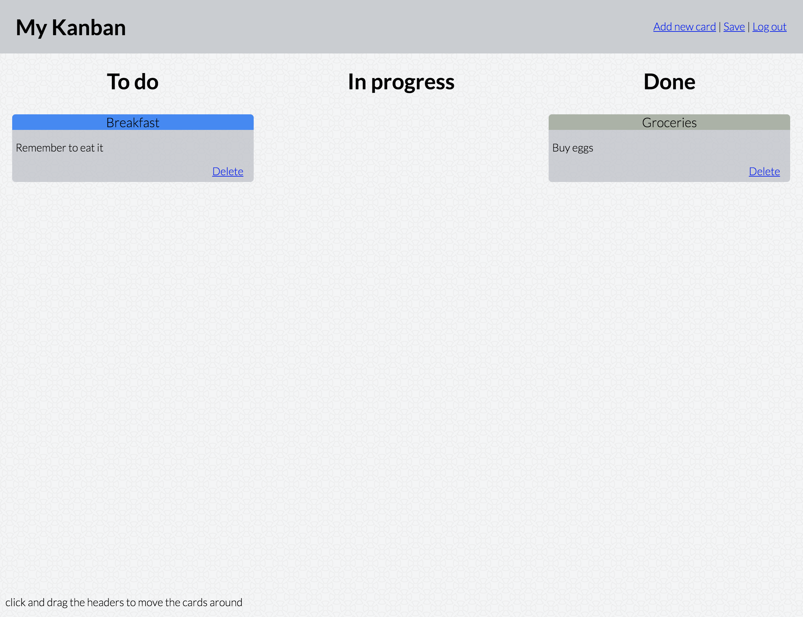

# Flask Kanban

A fully functional Kanban app with user accounts using Flask, HTML, CSS & Javascript. It uses the frontend developed [here](https://github.com/gwpicard/basic-kanban). The app also comes with unit tests to validate the functionality of app routes.

<p align="left">
  
</p>

<p align="left">
  
</p>

## Install Prerequisites

Go into the root directory of the app and run the following lines of code in terminal. This will ensure a virtual environment is set up with the correct packages installed.

```
python3 -m venv .venv
source .venv/bin/activate
pip install -r requirements.txt
```

## Running the code

To run the application, run the following pieces of code in sequence. The first will set up the data models as well as generate dummy data for the app. The second will run the flask app.

```
python3 dummy.py
python3 run.py
```

## Logging into the app

A default user accounts will be created after running `dummy.py`, you can log in with the following info:

```
email: test@gmail.com
password: 12345
```

## Running unit tests

To run tests, check test coverage on the app and generate a report, enter the following into terminal.

```
python3 -m unittest discover tests
coverage run tests.py
coverage report app/*.py
```

**Enjoy!**
